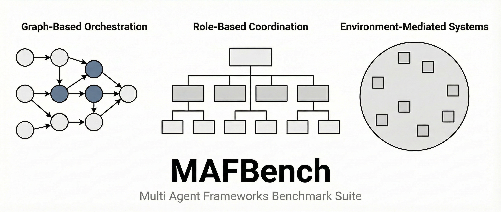

[](https://www.python.org/downloads/)
[](https://opensource.org/licenses/MIT)
[]()



MASBench is a framework-level evaluation suite that standardizes the systematic assessment of single-agent and multi-agent system architectures, orchestration mechanisms, and coordination protocols across diverse LLM-based agent frameworks.

## Conceptual Scope

MASBench addresses research questions concerning architectural trade-offs, orchestration overhead, coordination behavior, and scalability characteristics in LLM-based agent systems. The framework standardizes execution environments, evaluation protocols, and measurement methodologies to enable controlled comparison across different agent frameworks. By isolating framework behavior from task complexity and model capabilities, MASBench supports rigorous analysis of system design decisions and their performance implications.

## Architectural Perspective

MASBench organizes its evaluation space through a taxonomy of three primary framework paradigms:

- **Graph-based orchestration**: Frameworks that model agent workflows as directed graphs, where nodes represent computational steps and edges define control flow and data dependencies.

- **Role-based agent systems**: Frameworks that structure agents around specialized roles or personas, with coordination mechanisms that route tasks and information based on role assignments.

- **Environment- or simulation-mediated systems**: Frameworks that situate agents within shared environments or simulations, where interaction occurs through environment state and action interfaces.

These categories represent distinct architectural approaches to agent coordination and orchestration. MASBench evaluates frameworks through this lens, examining how each paradigm handles memory management, task routing, error recovery, and scalability.

## Evaluation Methodology Overview

MASBench integrates established benchmarks and evaluation protocols to assess framework behavior. The suite normalizes execution environments, logging mechanisms, and configuration interfaces to ensure consistent measurement across frameworks. Where possible, MASBench isolates framework-specific behavior from model capabilities and task complexity.

Evaluation proceeds along two dimensions: experimental assessment of capabilities (memory retention, planning accuracy, coordination efficiency) and architectural analysis of system design (orchestration patterns, communication topologies, resource utilization). Tool use is integrated as part of the evaluation infrastructure to support capability assessment, but is not itself subject to experimental evaluation due to model-dominated behavior and interface standardization constraints.

## Experiment Index

### Single-Agent Evaluation

- [Memory](single_agent/memory/readme.md)
- [Planning](single_agent/reasoning/README.md)
- [Specialization](single_agent/specialization/readme.md)
- [Framework Overhead](single_agent/framework_overhead/README.md)
- [Tool Use](single_agent/tool_use/README.md) (architectural)

### Multi-Agent Evaluation

- [Coordination & Topology](multi_agent/topology/README.md)

## Results & Artifacts

Experimental results are preserved in `results/` for transparency and reproducibility. The main README does not summarize or interpret findings; analysis and interpretation are documented within individual experiment directories and associated publications.

## Reproducibility & Execution Scope

MASBench enforces reproducibility through fixed Python version requirements (3.12.3), pinned dependency versions (specified in `requirements.lock`), and controlled execution environments. The suite abstracts LLM backends to support cost-aware execution and framework-agnostic evaluation. All experiments are designed to execute from a clean Python environment with minimal external configuration.

## Citation

```bibtex
@article{masbench2024,
  title={Evaluating Multi-Agent Frameworks: A Taxonomy and Experimental Perspective},
  author={To be updated},
  journal={To be updated},
  year={To be updated},
  doi={To be updated}
}
```

*To be updated upon publication.*

## Contact

Abdelghny Orogat  
Concordia University  
Abdelghny.Orogat@concordia.ca
